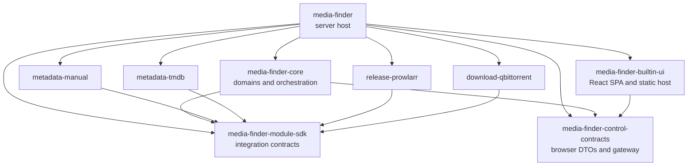
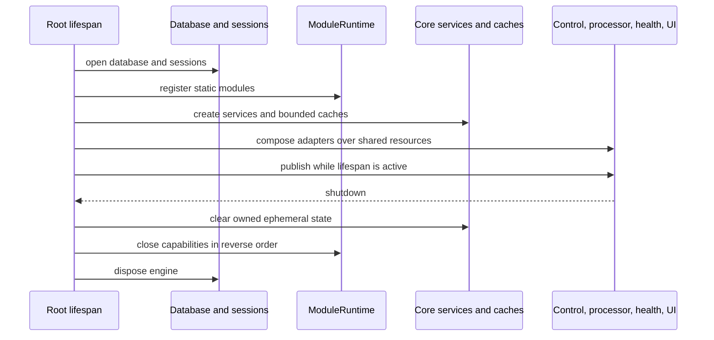

# Architecture

Media Finder is a package-enforced modular monolith. It ships one process and
one image, but its source is divided into independently buildable distributions
with explicit contracts and executable dependency rules. This is the smallest
deployment model that satisfies the current product: a self-hosted catalog and
acquisition control plane with replaceable integrations and UI.

## System boundary

Media Finder owns catalog state, immutable metadata revisions, collections,
release selection, acquisition records, naming, NFO projection, and integration
orchestration. It does not scan, move, mux, or monitor media files and does not
invoke a media server. External processors consume the versioned processor API
after a download client accepts an acquisition.

The supported external boundaries are:

- `/api/control/v1` for a same-origin browser UI;
- `/api/v1` for authenticated processors;
- `/health/live` and `/health/ready` for operations;
- the checked module SDK and serialized module artifacts for in-repository,
  statically packaged integration modules.

Python imports from the server or core are not external APIs.

## Package graph

The graph is enforced by package metadata and AST-based architecture tests in
[`tests/architecture/test_package_boundaries.py`](../tests/architecture/test_package_boundaries.py).
The repository root is a virtual uv workspace, not a tenth distribution.

## Package ownership

| Distribution | Owns | Must not own |
| --- | --- | --- |
| `media-finder` | Production composition, FastAPI adapters, browser security, CLI, root lifespan, selected first-party registrations | Domain policy hidden from core, a second integration lifecycle, reusable module contracts |
| `media-finder-core` | Catalog, acquisition, exports, control orchestration, persistence adapters, transactions, bounded caches, module lifecycle | Concrete integration packages, templates, provider-specific branches |
| `media-finder-module-sdk` | Module manifests, environment declarations, DTOs, protocols, typed registrations, errors, conformance, serialized fixture models | Core services, database access, HTTP framework, concrete transports |
| `media-finder-control-contracts` | Stable browser DTOs, error envelope, `ControlGateway` protocol | FastAPI, persistence, integrations, UI rendering |
| `media-finder-builtin-ui` | React/TypeScript browser source, generated control types, localized presentation catalogs, deterministic MSW fixtures, and packaged static assets | Core, server, SDK, ORM, database, concrete modules |
| First-party module wheels | One integration implementation, its transport, manifest, translations, fixtures, conformance data | Core, persistence, browser routes or assets, sibling modules, process-wide environment access |

## Core bounded contexts

The core is vertically divided under `packages/core/src/media_finder_core`:

- `catalog` owns collections, media identity, immutable metadata revisions,
  Manual editing, provider selection, and retention application;
- `acquisition` owns release-selection tokens, pinned metadata references,
  idempotent submission, immutable module-version snapshots, and reconciliation;
- `exports` owns current or pinned metadata projection, naming, and NFO output;
- `control` owns browser-control orchestration, opaque cursor/token behavior,
  safe DTO projection, and stable error translation;
- `module_runtime` resolves declared environment, constructs and validates module
  capabilities, caches one winner per registration, and closes owned instances;
- `platform` owns database construction and migration, transaction primitives,
  clocks, bounded ephemeral storage, safe errors, and maintenance cadence.

Contexts communicate through immutable values and narrow ports. SQLAlchemy is
confined to context persistence adapters and platform transaction/database
modules. The executable layout and import constraints live in
[`tests/architecture/test_core_bounded_contexts.py`](../tests/architecture/test_core_bounded_contexts.py).

## Composition and lifecycle

`media_finder_server.runtime.run()` migrates the database before starting the
server. `create_application()` returns an allocation-free ASGI shell whose root
lifespan opens exactly one attempt-local resource graph:

Construction and cleanup are implemented in
[`apps/server/src/media_finder_server/runtime.py`](../apps/server/src/media_finder_server/runtime.py).
The lifespan owns every resource before it becomes reachable, performs
best-effort reverse cleanup, and preserves the original startup or serving
failure. Child applications borrow the shared graph and never close it.

The typed module runtime is implemented in
[`packages/core/src/media_finder_core/module_runtime/lifecycle.py`](../packages/core/src/media_finder_core/module_runtime/lifecycle.py).
It constructs outside its lock, validates before adoption, closes failed or
losing concurrent attempts, returns one cached capability, and closes all owned
capabilities exactly once in reverse order.

## Static module model

First-party modules are trusted reviewed code. The host imports their public
`registration()` functions and creates one immutable `StaticModuleRegistry` in
[`apps/server/src/media_finder_server/modules.py`](../apps/server/src/media_finder_server/modules.py).
The host also explicitly selects the single release provider and download client
used by the current acquisition flow. Adding a second registration must not
silently change that selection.

This is intentionally not a runtime plugin platform:

- modules are installed at image build time from the same lock and product
  version;
- there is no directory scanner, entry-point loader, marketplace, module mount,
  or runtime installation API;
- a module receives only the environment values declared in its manifest;
- modules share the process and therefore are not a security sandbox.

The registry validates identity, kind, SDK compatibility, capabilities, and
environment declaration conflicts before runtime construction. Core defensively
revalidates module-owned DTOs at trust boundaries and translates module errors
to stable safe public codes.

## HTTP and UI boundaries

The built-in UI is a replaceable presentation package, not an integration
plugin. It depends only on `media-finder-control-contracts` and presentation
libraries. A deterministic fake gateway runs the complete UI without SQLite or
integrations. Production passes the real gateway from the host.

An alternative UI may be implemented in any language against the checked
`/api/control/v1` OpenAPI document. It is deployed behind the same origin and
reverse-proxy authentication as Media Finder; CORS and a browser bearer token
are intentionally absent. The processor API remains a separate bearer-authenticated
contract and never exposes integration credentials to the browser.

## Persistence and consistency

SQLite is the current store. Context repositories do not commit implicitly;
application services own write scopes and short transactions. Catalog revisions
are append-only except for explicit retention purge of provider-owned payload.
Acquisitions persist exact release/download module IDs and versions at
submission time. Runtime module upgrades do not rewrite historical snapshots.

There is one clean schema head because the application had no production data
when this architecture was established. Future schema changes require an
OpenSpec change, migration, clean-upgrade test, and schema-drift check.

## Trust and security boundaries

- Reverse-proxy authentication protects the browser UI and control API when
  published on a network.
- Browser mutations require the signed `mf_session` cookie and CSRF token.
- Processor endpoints use a separate bearer token that is never delivered to
  UI code.
- Integration secrets exist only in process environment and module-owned
  transports; they are not persisted, rendered, or returned in errors.
- Each networked module owns a separate HTTP client and cookie jar.
- Opaque browser selections are bounded, expiring, process-local, and single-use
  where the contract requires consumption.

Because modules execute in-process, code review and static inclusion are part of
the trust boundary. Do not describe the SDK as isolation from malicious code.

## When to introduce another process

Keep a module in-process while it is released with the application, owned by the
same maintainers, uses the same availability target, and does not need independent
scaling. Move a boundary out of process only when at least one observed requirement
justifies the operational cost:

- independently trusted or third-party executable code;
- a separate release cadence or ownership team;
- independent scaling or resource isolation demonstrated by measurements;
- fault containment that cannot be achieved with current timeouts and bounds;
- a non-Python implementation that must be deployed independently.

That change would require a new versioned wire protocol, authentication,
deployment, health, compatibility, and failure semantics. Do not add those
mechanisms speculatively. The existing browser and processor HTTP APIs already
provide language-independent boundaries where they are currently needed.

## Change governance

OpenSpec is the source of truth for behavior and architecture. Changes to module
contracts, control contracts, persistence, deployment, or operator behavior must
start with an approved OpenSpec change and proceed through focused RED/GREEN
tests. Generated schemas, OpenAPI documents, fixtures, assets, and locales are
checked artifacts. The seven `verification/*` GitHub checks enforce documentation,
Python/package boundaries, unit, integration, contract, browser, and production
image behavior.
