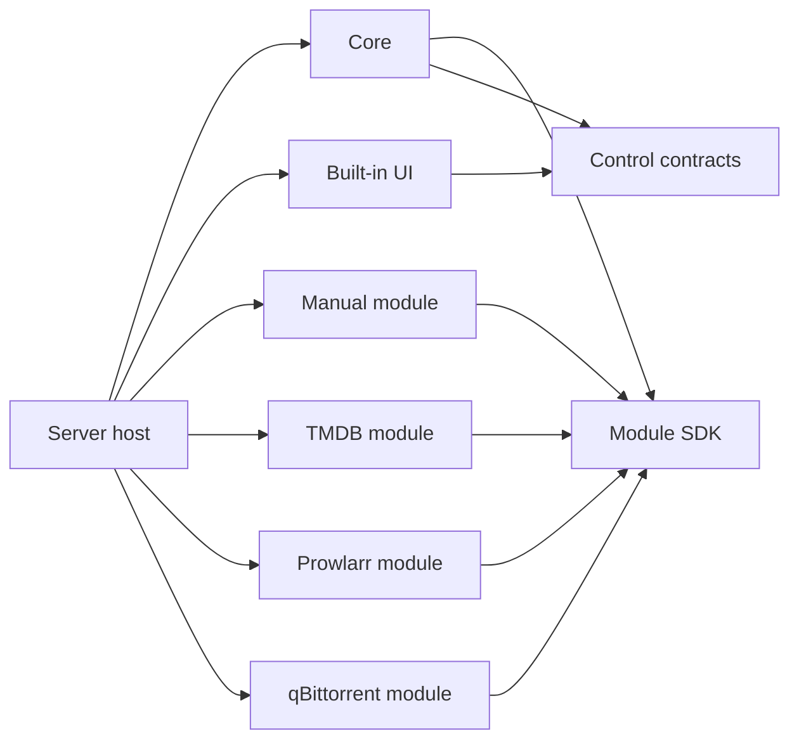

## Context

See `proposal.md` for motivation. The current repository is already a testable modularizing monolith: `media-finder-control-contracts` and `media-finder-builtin-ui` are separate workspace distributions, `/api/control/v1` and `/api/v1` are explicit HTTP boundaries, and 302 tests pass on the pre-change baseline. The remaining backend distribution still combines the module SDK, first-party integrations, ORM records, use cases, HTTP adapters, composition, and several large coordination modules. Prowlarr is a core-special adapter rather than the third module kind identified in `docs/research/modular-media-systems.md`.

There are no users, supported third-party Python imports, or persistent data that must survive this pre-release reorganization. Public product behavior and serialized HTTP contracts still have value as characterization seams, but internal imports and the development database schema do not require compatibility shims. The change is therefore a lit-system freeze-then-lift refactor, not a greenfield rewrite and not a legacy-resurrection project.

## Goals / Non-Goals

**Goals:**

- Make architectural ownership executable through wheel dependencies, public package APIs, architecture tests, conformance tests, and deterministic contract artifacts.
- Give core explicit bounded contexts without duplicating an entire domain graph merely to achieve framework purity.
- Make Manual, TMDB, Prowlarr, and qBittorrent ordinary first-party implementations of the same SDK available to future repository contributors.
- Preserve one process, one container, one database, the built-in UI default, and existing browser and processor HTTP behavior.
- Make semantic module and HTTP contracts portable enough for a later non-Python implementation without requiring current Python modules to run unchanged.

**Non-Goals:**

- Runtime discovery, installation, updating, dependency resolution, signing, marketplace governance, or sandboxing of modules.
- A universal plugin base class, event bus, priority hooks, dynamic dependency-injection access, module-defined routes, module-owned migrations, or module-to-module calls.
- Separate services, processes, databases, workers, queues, containers, release trains, or package registries.
- A second official UI, a SPA rewrite, cross-origin UI support, or changes to `/api/control/v1`, `/api/v1`, HTML paths, or localization behavior.
- Making naming, NFO rendering, maintenance scheduling, opaque-token storage, or browser security into modules before a second implementation creates a real extension requirement.
- Preserving legacy internal Python import paths or upgrading existing development database contents.

## Decisions

### 1. Use a package-enforced modular monolith with a separate host

The root project becomes a virtual uv workspace. Production code is assembled from the following distributions:

```text
apps/
  server/                         media-finder / media_finder_server

packages/
  core/                           media-finder-core / media_finder_core
  module-sdk/                     media-finder-module-sdk / media_finder_sdk
  control-contracts/              media-finder-control-contracts / media_finder_control
  builtin-ui/                     media-finder-builtin-ui / media_finder_builtin_ui
  modules/
    metadata-manual/              media-finder-metadata-manual
    metadata-tmdb/                media-finder-metadata-tmdb
    release-prowlarr/             media-finder-release-prowlarr
    download-qbittorrent/         media-finder-download-qbittorrent

schemas/
  module-sdk/v1/
  processor-api/v1/
docs/api/
  control-v1.openapi.json
```

`apps/server` is intentionally small. It imports concrete module registrations and the optional built-in UI, creates the static registry, constructs core, mounts FastAPI adapters, and owns the root lifespan. The server host is the only package allowed to know every implementation.

The dependency graph is:



The root workspace uses one `uv.lock`, Python 3.13, Hatchling source layouts, and lockstep product versions. Each wheel includes `py.typed`; `__init__.py` exports an explicit `__all__`; package tests install wheels in empty targets so source-tree leakage cannot hide undeclared dependencies.

Alternatives rejected:

- Namespace-only directories in one wheel do not enforce dependencies and leave integrations coupled to backend internals.
- Putting concrete modules in core recreates the current privileged first-party bypass.
- Independent services add deployment, failure, tracing, and compatibility costs without independent scaling, ownership, or trust requirements.

### 2. Organize core by bounded context, with pragmatic ports and adapters

`media_finder_core` is vertically partitioned:

```text
media_finder_core/
  catalog/
    models.py
    commands.py
    queries.py
    ports.py
    persistence.py
  acquisition/
    models.py
    commands.py
    queries.py
    ports.py
    persistence.py
  exports/
    metadata.py
    naming.py
    nfo.py
    ports.py
  module_runtime/
    registry.py
    configuration.py
    lifecycle.py
    diagnostics.py
  control/
    catalog.py
    metadata.py
    acquisition.py
    diagnostics.py
    facade.py
    security.py
  platform/
    database.py
    transactions.py
    maintenance.py
    errors.py
```

Directories are shallow and files are split by change reason rather than by a mandatory layer template. Domain value objects and invariants remain framework-free when they carry behavior. SQLAlchemy records live in the owning context's `persistence.py`; application services consume declared repository/query ports and do not return ORM values. The design does not create a complete second entity graph mirroring every SQLAlchemy column. Repository adapters map only the immutable values and command results required at context boundaries.

Cross-context coordination occurs through application ports:

- acquisition consumes catalog identity and revision read ports;
- exports consume catalog and acquisition snapshot queries;
- control facade delegates to catalog, metadata, acquisition, export, and diagnostic services;
- maintenance uses catalog revision ports and registered provider retention policies;
- contexts exchange scalar IDs and immutable SDK/control DTOs, never foreign ORM instances.

Database foreign keys remain valid because one core owns one database, but cross-context SQLAlchemy relationships are removed. This retains integrity without turning ORM navigation into an implicit API.

Alternatives rejected:

- A strict textbook Clean Architecture with duplicate domain and persistence aggregates adds mapping cost without a current second persistence implementation.
- Direct `Session` use in application services keeps tests and transactions coupled to SQLAlchemy and prevents meaningful context boundaries.
- A generic event bus obscures transaction ownership and introduces ordering and retry semantics that no current workflow requires.

### 3. Keep persistence core-owned and replace the pre-release schema atomically

The new initial schema has explicit owners:

| Owner | Durable records |
| --- | --- |
| Catalog | collections, media items, immutable metadata revisions |
| Acquisition | acquisitions and immutable release/module submission snapshots |
| Platform | maintenance execution state |

The legacy generic `app_settings` table and mutable `download_client_instances` table are removed. Integration configuration remains process-only. An Acquisition stores the metadata revision ID, release-provider ID/version, download-client ID/version, destination, correlation, safe release snapshot, naming profile, status, and external task result. It stores no module configuration or environment reference.

Existing migrations are squashed into a new initial migration before the next stable release. Starting against an old development Alembic revision fails explicitly; developers and test operators recreate `/data`. There is no silent data conversion and no compatibility model. Fresh-schema migration, SQLite WAL/foreign-key settings, readiness, schema drift, immutability, idempotency, and savepoint behavior remain covered by integration tests.

Alternative rejected: retaining legacy tables solely for rollback would make an unsupported pre-release database format a permanent core contract. If persistent production data exists before apply begins, the change must be updated rather than silently implementing this decision.

### 4. Publish one narrow SDK for three module kinds and four specialized capabilities

`media-finder-module-sdk` contains:

- immutable Pydantic DTOs and stable error categories;
- `MetadataProvider`, optional `MetadataEditor`, `ReleaseProvider`, and `DownloadClient` protocols;
- typed registrations and module lifecycle contracts;
- manifest and environment-declaration models;
- capability-specific conformance fixtures and runners;
- deterministic JSON Schema generators.

It does not depend on FastAPI, SQLAlchemy, Jinja, core, control contracts, or concrete HTTP libraries. It exposes no service container, database abstraction, router registration, generic callback, or module lookup API.

The Python v1 operations remain synchronous because current provider/client implementations, SQLAlchemy transaction flow, and tests are synchronous. Core invokes blocking external operations through its existing bounded thread-execution boundary. A future SDK major may become async if measured concurrency or cancellation requirements justify the compatibility cost; async is not necessary to establish module ownership.

Each module owns its concrete HTTP transport and returns an SDK-closeable capability instance. A registration factory receives only `ResolvedModuleEnvironment`, a deeply immutable value object containing values declared by that module. Secret entries use redacted representations. The factory does not receive `os.environ`, a global secret resolver, an `httpx.Client`, core services, or a DI container. The module creates an isolated transport and its `close()` releases it; root lifecycle owns when close is called.

Metadata registration additionally exposes a configuration-free retention policy object so mandatory purge decisions remain available when provider credentials are absent. Core supplies the persisted `RetentionSubject`, clock value, and policy envelope; the module returns typed decisions and never receives persistence access.

A metadata registration may also expose a narrowly typed `MetadataEditor` factory when its manifest declares the `metadata-edit` capability. The editor validates provider-owned import documents and can merge bounded episode-table input into normalized metadata. It receives immutable SDK DTOs and bytes only; it receives no database session, control DTO, UI form, or generic extension context. Manual uses this sub-capability for JSON identity validation and atomic CSV episode semantics. Core owns confirmation, transaction, persistence, and application orchestration, while the server injects the selected editor into that use case. Core therefore contains neither a concrete `manual` module identifier nor Manual-specific parsing. A generic hook map and moving Manual parsing into core are both rejected because they would respectively recreate an untyped plugin surface or make one module's dialect a core invariant.

### 5. Make `module.toml` the inspectable manifest and registration the executable factory

Every module wheel contains a root package resource named `module.toml`. It is the canonical value-free manifest:

```toml
module_id = "tmdb"
module_kind = "metadata-provider"
module_version = "0.1.0"
sdk_compatibility = ">=1,<2"
contract_version = "1"
capabilities = ["search", "fetch", "normalize", "retention", "export-warning"]
name_key = "module.tmdb.name"

[[environment]]
name = "TMDB_TOKEN"
required = true
secret = true
description_key = "module.tmdb.environment.token"
```

The SDK loader validates it without importing implementation code. A package exports one `registration()` function that loads the same manifest and returns the matching typed factory. Host registration rejects duplicate IDs, kind mismatches, incompatible SDK ranges, contract versions, environment conflicts, or capabilities unsupported by the specialized registration.

Module versions are recorded in relevant durable snapshots but first-party package versions remain lockstep with the product. `sdk_compatibility` documents future compatibility before independent module release trains exist.

Alternative rejected: declaring the manifest only as a Python object prevents documentation and future non-Python tooling from inspecting a module without importing it.

### 6. Treat Prowlarr as a release provider while core owns selections

Prowlarr moves to `media-finder-release-prowlarr`. Its SDK contract searches bounded torrent candidates and resolves one provider-private selection into `MagnetArtifact` or `TorrentArtifact`. Search candidates contain safe display/snapshot fields plus an internal resolution value; core stores the complete internal value in its bounded TTL cache and returns only a one-use opaque token to control/UI callers.

Core, not the release module, owns cache capacity, TTL, eviction, token generation, single-use semantics, confirmation, Acquisition creation, artifact size validation, safe persisted snapshots, and idempotency. The module owns Prowlarr URL confinement, authentication, result interpretation, artifact download, protocol filtering, and upstream error translation.

The default host statically selects Prowlarr as its sole release provider and qBittorrent as its sole download client, preserving current UI behavior. The typed registries support additional implementations, but multi-provider release aggregation and runtime client selection require a later product change because their ambiguity and UX are not justified now.

### 7. Preserve the UI and HTTP seams while splitting backend orchestration

The built-in UI package and control-contract package remain as completed by `decouple-builtin-ui`. UI dependency rules do not change. `BackendControlGateway` is decomposed into context-specific control services plus a small facade implementing the existing `ControlGateway` protocol. The facade coordinates stable DTOs; it does not query ORM records or build integrations directly.

FastAPI control, processor, health, and browser-session adapters move to the server host because HTTP is a delivery concern. Core supplies framework-neutral use cases, browser-security services, and safe error values. The checked control OpenAPI and processor behavior are characterization gates: package movement must not change paths, status codes, authentication, request/response schemas, pagination, CSRF, cookies, or error envelopes.

The built-in UI dev host continues to run solely against its deterministic fake gateway. This remains the proof that UI development is independent of core, SQLite, and integrations.

### 8. Use serialized schemas and fixtures as the portability seam

OpenSpec remains the normative behavior source. Current Python Pydantic models remain the authoring binding, while CI generates canonical JSON Schemas for module manifests and DTOs plus deterministic OpenAPI for browser and processor APIs. Canonicalization removes ordering and generator-noise differences but not semantic changes. Checked fixtures include success, missing configuration, standardized failure, locale/identity behavior, retention, safe release snapshots, artifact capabilities, correlation, payload bounds, and secret redaction.

Conformance has two layers:

1. Python package conformance executes every operation against module fixtures and verifies lifecycle/architecture rules.
2. Serialized conformance fixtures validate wire shapes, error semantics, and version metadata independently of Python imports.

This is sufficient for a future rewrite. Schema-first code generation, TypeSpec, protobuf, JSON-RPC, and cross-process module execution are deferred because no non-Python implementation exists yet.

### 9. Enforce trusted in-process boundaries honestly

First-party and repository-contributed modules are trusted reviewed code sharing the process failure domain. Architecture tests prohibit direct core, ORM, router, template, environment, and sibling-module imports. Core validates returned DTOs, bounds caches and artifacts, translates failures, and retains transaction ownership. Each live module owns an isolated HTTP session so cookies and authorization state cannot cross integration boundaries.

These controls improve correctness but are not a sandbox: trusted Python code can still import operating-system and networking APIs. Supporting unreviewed or separately distributed modules would require an out-of-process protocol and is an explicit future architecture trigger, not a claim of this design.

### 10. Keep one release train and protected CI surface

The existing seven `verification/*` contexts remain unchanged. Their reusable workflow gains package-isolated wheel builds, import-boundary tests, module-manifest/schema drift, three conformance suites, clean migration, both UI modes, and the existing API/browser/image smoke. Docker installs built wheels rather than relying on workspace source paths. GHCR tags, one container, non-root UID, Compose shape, and health semantics remain unchanged.

The root workspace version is the product version. No module is published independently during the MVP, despite carrying manifest compatibility metadata.

### 11. Subtraction pass

The design intentionally removes rather than adds runtime machinery:

- no compatibility package for `media_finder.sdk` or other old internal imports;
- no legacy client-instance or generic settings persistence;
- no service boundary around packages;
- no event bus, queue, worker, plugin loader, marketplace, or package registry;
- no shared domain superclass beyond small stable identifiers and values;
- no generalized multiple-release-provider UI;
- no independently versioned first-party release train;
- no schema-first code generator before another language consumes the artifacts.

Removing any of the retained components would break a current approved requirement: the host is needed for dependency inversion, the SDK for replaceable integrations, control contracts for UI independence, core contexts for ownership, and serialized artifacts for verified portability.

## Risks / Trade-offs

- **[Large file movement can accidentally change behavior]** → Preserve control/processor OpenAPI snapshots, HTML browser tests, module fixtures, database invariants, and existing focused tests as characterization gates; move one vertical seam at a time.
- **[Temporary duplicate paths can become permanent]** → Each migration task ends by deleting the superseded source and adding a negative import check; no compatibility shim is permitted.
- **[The SDK can become a dumping ground]** → Admit a type only when at least one specialized module operation needs it; core/UI/framework helpers remain prohibited and public `__all__` plus schema snapshots expose growth in review.
- **[One large change has merge and review cost]** → Use staged, independently green commits ordered by dependency direction: SDK, modules, core contexts, host, persistence reset, then delivery cleanup. Do not operate parallel old and new business paths.
- **[Fresh schema is destructive for an unexpected deployment]** → Before apply, verify and document the no-data assumption. If any persistent deployment must be preserved, stop and update the change with a migration contract.
- **[Synchronous modules can consume thread capacity]** → Preserve strict timeouts, result bounds, and isolated execution; introduce an async SDK major only after observing a concurrency or cancellation requirement.
- **[In-process modules are not security-isolated]** → Keep static reviewed inclusion and explicit trust documentation; move to process isolation only if untrusted or independently distributed modules become a requirement.
- **[Serialized artifacts may be mistaken for a cross-process protocol]** → Document them as semantic compatibility and testing artifacts; do not promise transport, discovery, or remote lifecycle semantics.
- **[Lockstep packaging limits independent delivery]** → Accept the constraint while one team owns one image; independent package publishing becomes justified only when external module repositories or release cadences exist.

## Migration Plan

1. Record the current test, OpenAPI, browser, image, and fresh-migration baseline and add architecture tests that initially describe the intended package graph.
2. Convert the root into a virtual uv workspace and create buildable empty server-host, core, and module-SDK distributions without moving runtime behavior.
3. Move public SDK DTOs, manifests, registrations, errors, schema generation, fixtures, and conformance runners; update all consumers to the new SDK and remove `media_finder.sdk`.
4. Extract Manual, TMDB, Prowlarr, and qBittorrent sequentially into their own wheels, making each pass isolated build, architecture, and capability conformance before removing its old source.
5. Split core into catalog, acquisition, exports, module-runtime, control, and platform contexts; replace direct ORM coordination with focused ports and decompose the control facade without changing HTTP DTOs.
6. Replace the development schema with the new core-owned initial migration, remove legacy settings/client tables and cross-context ORM relationships, and verify fresh migration and persistence invariants.
7. Move FastAPI composition and adapters into the server host, explicitly register first-party modules there, and prove one lifespan owns all resources in built-in and disabled UI modes.
8. Add deterministic module JSON Schemas, processor OpenAPI, serialized conformance fixtures, isolated wheel builds, dependency rules, and Docker installation from built wheels to existing verification jobs.
9. Update English contributor, module-authoring, architecture, environment, deployment, and database-reset documentation; regenerate assets and localization catalogs without changing UI behavior.
10. Run the complete repository and production-image verification matrix, sync the delta specs, archive the change, and only then publish the first image using the new schema.

Rollback during development is a source rollback plus recreation of the disposable `/data` volume. There is no supported in-place database rollback across this pre-release schema reset. Production rollout must not begin until the change is archived and the no-persistent-data assumption has been revalidated.
